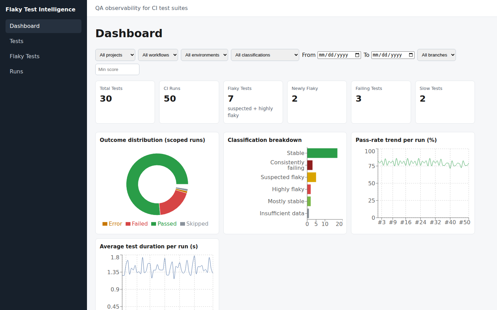

# Flaky Test Intelligence Platform

CI test suites fail — but which failures are real regressions, which are
broken environments, and which are flaky tests crying wolf? This platform
collects JUnit results across CI runs, stores execution history in
PostgreSQL, scores every test with a documented statistical engine, and
presents the answers in a QA observability dashboard.



More evidence: [flaky ranking](docs/screenshots/02-flaky-ranking.png),
[test detail](docs/screenshots/03-test-detail.png),
[execution history](docs/screenshots/04-execution-history.png),
[trend charts](docs/screenshots/05-trend-charts.png),
[API docs](docs/screenshots/06-api-docs.png), and
[mobile dashboard](docs/screenshots/07-mobile-dashboard.png). These screenshots
were captured from the working system (see [docs/demo-script.md](docs/demo-script.md));
they are not mockups.

## Problem

CI dashboards show per-run pass/fail. They don't answer the questions that
matter across runs: *is this test flaky or consistently broken? Is it
getting worse? Did it just start flaking? Which of our 500 tests should we
fix first?* Teams re-investigate the same flakes every week.

## Solution

```text
JUnit XML  →  secure parser  →  PostgreSQL history  →  analysis engine
                                                              ↓
Dashboard ← REST API ← flakiness score + classification + trends
```

Upload-once, know-forever: every run ingested makes the next triage faster.

## Features

- **JUnit ingestion** — secure XML parsing (XXE/entity-expansion safe),
  deterministic `project::classname::test_name` identity, duplicate guards
- **Statistical engine** — pass/failure rates, duration stats, outcome
  inconsistency, recency-weighted failures, duration instability, 0–100
  score, six-way classification, newly/persistently-flaky detection, trends
- **REST API** — projects, runs (+upload), tests, ranked flaky-tests,
  per-test history with cumulative scores, dashboard summary; consistent
  `{error, message, request_id}` errors
- **Dashboard** — KPI cards, flaky ranking table (search/filter/sort/
  paginate), outcome/severity/trend charts, test detail with execution
  history and failure messages, project/branch/workflow/environment/date
  filters
- **Deterministic demo** — `flakyctl seed-demo` builds 50 runs × 30 tests
  with ground-truth labels; the detector scores precision/recall 1.000
- **One-command ops** — Docker Compose, Codespaces devcontainer, GitHub
  Actions CI with JUnit artifacts

## Architecture

See [docs/architecture.md](docs/architecture.md) (with diagram),
[docs/data-model.md](docs/data-model.md), and
[docs/detection-algorithm.md](docs/detection-algorithm.md).

## Technology stack

| Layer | Choice |
|---|---|
| Backend | Python 3.12+, FastAPI, Pydantic, SQLAlchemy, Alembic, PostgreSQL |
| Testing | pytest, pytest-cov, httpx |
| Frontend | React 19, TypeScript, Vite, Recharts, React Router |
| Quality | Ruff, ESLint, Prettier, Vitest + Testing Library |
| DevOps | Docker, Docker Compose, GitHub Actions, Codespaces |

## Installation (local development)

Backend:

```bash
python -m venv .venv && source .venv/bin/activate
python -m pip install -e "backend[dev]"
cp .env.example .env
alembic -c backend/alembic.ini upgrade head
uvicorn app.main:app --reload --app-dir backend
curl localhost:8000/health   # {"status":"ok"}
```

Frontend:

```bash
npm --prefix frontend install
cp frontend/.env.example frontend/.env   # optional development proxy/API overrides
npm --prefix frontend run dev             # http://localhost:5173
```

## Run everything (Docker)

```bash
docker compose up --build
```

- Dashboard: http://localhost:3000
- API: http://localhost:8000/docs
- Health: http://localhost:8000/health

Seed demo data once the backend is up:

```bash
docker compose exec backend flakyctl seed-demo
```

Ports and credentials are overridable via a local `.env` file; see
`.env.example`. The backend container applies Alembic migrations on startup
and refuses to serve if they fail.

## Run in Codespaces

```text
Open repository
  ↓
Create Codespace (Code → Codespaces → Create codespace on main)
  ↓
docker compose up --build
  ↓
open dashboard (forwarded port 3000)
```

The dev container ships Python 3.12, Node 24, and Docker-in-Docker, and
forwards ports `3000` (dashboard), `8000` (API/Swagger), `5173` (Vite dev)
and `5432` (Postgres).

## CLI (`flakyctl`)

```bash
flakyctl seed-demo                                   # 50 deterministic CI runs x 30 tests
flakyctl ingest demo/sample-results.xml --project demo-project --run-number 51
flakyctl analyze                                     # classifications + precision/recall
flakyctl list-flaky --min-score 40 --limit 20
```

## API

Full reference with examples: [docs/api.md](docs/api.md). Interactive docs
at `/docs` (Swagger) when the backend runs. Key endpoints:

```text
GET  /api/projects            POST /api/projects
GET  /api/runs                POST /api/runs/upload (JUnit XML)
GET  /api/tests               GET /api/tests/{id}  GET /api/tests/{id}/history
GET  /api/flaky-tests         GET /api/dashboard/summary
```

## Dashboard

Filter by project, branch, workflow, environment, date range,
classification, and minimum score; rank flaky tests; open any test to see
why it was flagged (score components, execution history, score/duration
trends, unique failure messages).

## Detection algorithm

Documented end to end in [docs/detection-algorithm.md](docs/detection-algorithm.md):
inconsistency (70%) + failure recency with exponential decay (15%) +
duration instability (15%) → 0–100 score → `INSUFFICIENT_DATA`, `STABLE`,
`MOSTLY_STABLE`, `SUSPECTED_FLAKY`, `HIGHLY_FLAKY`, `CONSISTENTLY_FAILING`,
plus newly/persistently-flaky flags. A test with zero failures always
scores 0 — slow or variable duration alone never flags flaky.

## Testing

```bash
cd backend && python -m pytest            # 77 passed (sqlite) + opt-in PG gate
cd frontend && npm test                    # 35 tests, jsdom
```

CI (`.github/workflows/ci.yml`) runs backend lint/tests with a real
PostgreSQL service, frontend lint/tests/build, both Docker builds, and
publishes the backend JUnit XML as an artifact.

## CI/CD

Pushes and pull requests run the full pipeline: backend (install, Ruff,
pytest, coverage, JUnit artifact), frontend (`npm ci`, ESLint, Vitest,
production build), and Docker image builds. Self-ingestion of CI results
back into a hosted instance is intentionally not wired (needs deployment
credentials); the JUnit artifact keeps it a small future step.

## Demo (3–5 minutes)

Follow [docs/demo-script.md](docs/demo-script.md). Observed result on the
seeded dataset: `TP=9 TN=21 FP=0 FN=0 precision=1.000 recall=1.000`.
All demo failure messages are tagged `(synthetic demo data)`.

## Limitations

- JUnit XML is the only ingestion format (TestNG/Playwright JSON planned).
- Single-tenant, no authentication or RBAC.
- Trend/summary endpoints paginate at 200 items per request; very large
  suites need keyset pagination (roadmap).

## Roadmap

Additional report formats, GitHub Checks/PR comments for known flakes,
quarantine suggestions, auth/teams, webhook ingestion, failure-message
clustering, Slack alerts for newly-flaky tests. (Phases 15–17 of the build
plan: real-demo evidence capture, final QA audit, portfolio polish.)
