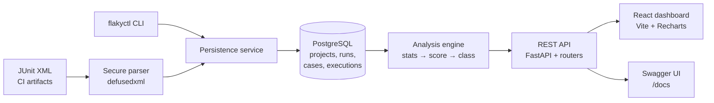

# Architecture

## System overview

The platform is a three-tier QA intelligence system: a FastAPI backend owns
ingestion, storage, and analysis; PostgreSQL owns history; a React
dashboard and a CLI consume a documented REST API.



Data flow for one CI run:

```text
POST /api/runs/upload (multipart .xml + metadata)
  → parse + validate → persist project/run/cases/executions (one commit)
  → run counters updated
GET /api/... → analyze executions on demand → score/classify → respond
```

Analysis is computed on read, never stored: scores always reflect current
threshold settings, and no backfill migration is ever needed.

## Components

| Component | Location | Responsibility |
|---|---|---|
| Secure parser | `backend/app/ingestion/parser.py` | JUnit → normalized cases; rejects unsafe/malformed input |
| Identity | `backend/app/ingestion/identity.py` | `project::classname::test_name` |
| Persistence | `backend/app/ingestion/service.py` | Project/run/case/execution rows, counters, dedupe, duplicate-run guard |
| Analysis | `backend/app/analysis/` | Statistics, scoring, classification, trends, history |
| REST API | `backend/app/api/` | Projects, runs, tests, flaky-tests, dashboard routers + error envelope |
| CLI | `backend/app/cli.py` (`flakyctl`) | seed-demo, ingest, analyze, list-flaky over the same services |
| Demo data | `backend/app/demo/` | Deterministic roster + ground truth + precision/recall evaluation |
| Dashboard | `frontend/src/` | Typed API client, pages, charts; no raw `fetch()` in components |

## Backend layout

```text
backend/
  app/
    main.py          FastAPI factory, middleware, router wiring
    core/            settings (env-driven), JSON logging, request IDs
    db/              engine, sessions, get_db dependency
    models/          Project, TestRun, TestCase, TestExecution + indexes
    ingestion/       schemas, parser, identity, persistence service
    analysis/        statistics, scoring, classification, service
    demo/            generator, evaluation
    api/             routers, response schemas, error envelope
    cli.py           flakyctl entry point
  alembic/           versioned migrations (batch mode for SQLite compat)
  tests/             pytest suite (SQLite + opt-in PostgreSQL gate)
  Dockerfile         migrations-then-serve entrypoint, non-root user
```

## Configuration & environments

All settings come from the environment (see `.env.example`); `.env` is never
committed. Local development points at `localhost` PostgreSQL; Docker
Compose overrides hostnames via service DNS. Dashboard API calls use a
same-origin URL: Vite proxies `/api` to the local backend in development,
and nginx proxies `/api` to the backend service in Docker. `VITE_API_URL`
is an optional override for deployments that use a separate API origin.

## Deployment

- `docker-compose.yml`: `postgres` (health-gated) → `backend` (migrates,
  then serves `:8000`) → `frontend` (nginx static on `:3000`).
- `.devcontainer/`: Codespaces with Python 3.12, Node 24, Docker-in-Docker.
- `.github/workflows/ci.yml`: backend (Ruff, pytest + PG service, JUnit
  artifact), frontend (ESLint, Vitest, build), Docker builds.

## Key decisions (ADR-style)

1. **PostgreSQL for history.** Time-ordered executions with relational
   integrity (FK cascades, uniqueness) fit a relational model; SQLite stays
   for fast unit tests, with an opt-in PG connectivity gate.
2. **Scores computed on read.** Thresholds are configuration; recomputing
   per request keeps every view consistent without backfills. Demo scale
   (50 × 30) responds in milliseconds; keyset pagination is the planned
   answer for very large suites.
3. **Deterministic demo data.** Pattern-based outcomes (no uncontrolled
   randomness) make precision/recall reproducible and reviewable.
4. **Envelope errors.** Every failure returns `{error, message, request_id}`;
   500s never leak tracebacks or credentials.
5. **Alembic batch mode.** One migration path works on both PostgreSQL and
   SQLite.
